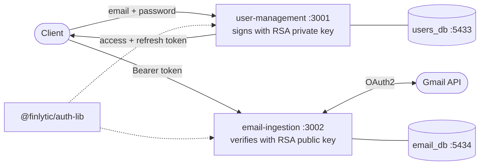

# Finlytic

A microservice ecosystem for ingesting and analysing financial email — invoices, statements,
receipts — starting with Gmail and Zoho Mail.

[](https://github.com/DushyantSinghInda/finlytic-ecosystem/actions/workflows/ci.yml)

Built in public, one service at a time, with every architectural decision written down and
justified. Authentication is hand-rolled rather than delegated to Auth0 or Clerk — deliberately,
to understand the primitives rather than configure them.

---

## Architecture



`email-ingestion` makes **no runtime calls** to `user-management`. It authenticates users by
verifying token signatures against a public key it already holds — verified by shutting
`user-management` down and watching authentication continue to work.

| Component | Port | Responsibility |
|---|---|---|
| `user-management` | 3001 | Identity, password hashing, token issue/rotation |
| `email-ingestion` | 3002 | Mailbox connections, OAuth, message ingestion |
| `@finlytic/auth-lib` | — | Shared JWT verification guard |

---

## Design decisions

**RS256, not HS256.** The identity service holds the private key and signs; every other
service holds only the public key and verifies. A breach in a peripheral service cannot
produce a forged admin token. Trade-off: JWTs can't be revoked, so access tokens live 15
minutes — the maximum exposure window if one leaks.

**Refresh token rotation with family revocation.** Refresh tokens are opaque random strings
stored as SHA-256 hashes and rotated on every use. Replaying a spent token revokes the entire
session family. A stolen token works exactly once; the next rotation by either party destroys
the session.

**Two hash functions, two jobs.** argon2id for passwords (low entropy — make each guess
expensive). SHA-256 for refresh tokens (256 bits of randomness, and argon2's per-hash salt
makes indexed lookup impossible).

**Constant-time login failures.** A decoy argon2 hash runs when no user exists, so response
time can't reveal which emails are registered.

**Database per service, physically.** Two Postgres instances, not two schemas. A cross-service
`SELECT` fails with `relation does not exist`. The cost — stated openly — is referential
integrity: `mail_accounts.user_id` has no foreign key, and deletion must propagate as an event.

**OAuth tokens encrypted at rest.** AES-256-GCM, stored as a versioned self-describing envelope
(`v1.nonce.tag.ciphertext`) so keys can be rotated without a migration. A database dump yields
inert ciphertext.

**CSRF-protected OAuth callbacks.** The `state` parameter is an HMAC-signed, 10-minute payload
binding the flow to a user — the callback has no `Authorization` header, so `state` *is* the
authentication.

**Provider adapter from day one.** `MailProviderAdapter` contains no Google vocabulary, so a
second provider is one new file rather than a refactor.

---

## Stack

TypeScript · NestJS 11 · PostgreSQL 17 · Prisma 7 · Redis · BullMQ · Docker Compose ·
npm workspaces monorepo

---

## Getting started

**Prerequisites:** Node.js 24+, Docker Desktop, a Google Cloud project with the Gmail API
enabled and an OAuth 2.0 Web application client.

```bash
git clone https://github.com/DushyantSinghInda/finlytic-ecosystem.git
cd finlytic-ecosystem
npm install
npm run infra:up          # Postgres x2 + Redis
```

Copy each `.env.example` to `.env` and fill it in:

```bash
cp services/user-management/.env.example services/user-management/.env
cp services/email-ingestion/.env.example services/email-ingestion/.env
```

Generate the RS256 key pair (`user-management`), then copy the **public** key to
`email-ingestion` — never the private one:

```bash
cd services/user-management
mkdir -p keys
openssl genpkey -algorithm RSA -pkeyopt rsa_keygen_bits:2048 -out keys/jwt-private.pem
openssl rsa -in keys/jwt-private.pem -pubout -out keys/jwt-public.pem
mkdir -p ../email-ingestion/keys
cp keys/jwt-public.pem ../email-ingestion/keys/jwt-public.pem
```

Generate an encryption key for `email-ingestion` and put it in `ENCRYPTION_KEY`, plus a second
one for `OAUTH_STATE_SECRET`:

```bash
node -e "console.log(require('crypto').randomBytes(32).toString('base64'))"
```

Migrate and run:

```bash
cd ../..
npm run prisma:migrate -w services/user-management -- --name init
npm run prisma:migrate -w services/email-ingestion -- --name init
npm run build:all
npm run start:dev -w services/user-management     # terminal 1
npm run start:dev -w services/email-ingestion     # terminal 2
```

---

## API

**`user-management` — :3001**

| Method | Route | Auth | Purpose |
|---|---|---|---|
| POST | `/auth/register` | — | Create an account |
| POST | `/auth/login` | — | Access + refresh token |
| POST | `/auth/refresh` | — | Rotate the refresh token |
| POST | `/auth/logout` | — | Revoke the session family |
| GET | `/users/me` | Bearer | Current profile |
| GET | `/health` | — | Liveness + DB |

**`email-ingestion` — :3002**

| Method | Route | Auth | Purpose |
|---|---|---|---|
| GET | `/oauth/gmail/authorize` | Bearer | Google consent URL |
| GET | `/oauth/gmail/callback` | signed `state` | Exchange code, store encrypted tokens |
| GET | `/accounts` | Bearer | Connected mailboxes |
| GET | `/health` | — | Liveness + DB + encryption self-test |

---

## Roadmap

- [x] User management — registration, login, token rotation, RS256
- [x] `@finlytic/auth-lib` — shared verification
- [x] `email-ingestion` — stateless cross-service auth
- [x] Gmail OAuth — encrypted token storage
- [ ] Gmail sync worker — BullMQ, incremental `historyId` sync
- [ ] Zoho Mail adapter
- [ ] Message parsing and classification
- [ ] Object storage for bodies and attachments

## License

MIT